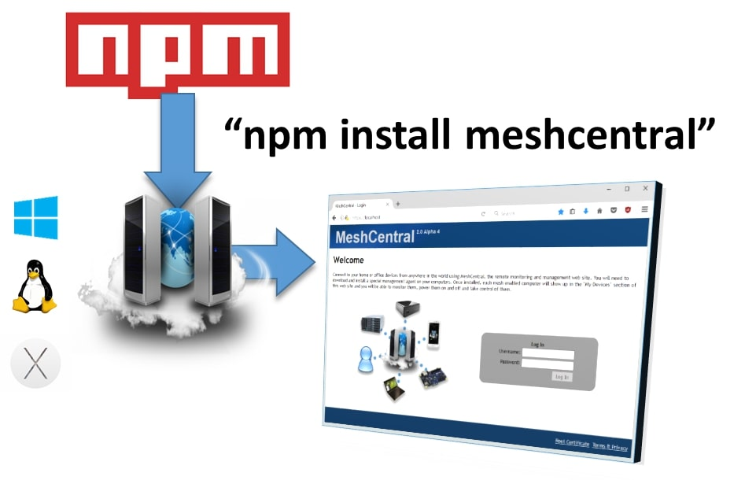

# 📦 面向高级用户的 NPM 安装



## 前提条件和验证

在开始安装之前，请确保在您的宿主操作系统上已安装 **Node.js** 和 **NPM**（Node 包管理器）。

如果您的服务器位于 HTTP/HTTPS 代理后面，您可能需要配置 NPM 的代理设置。

### 1\. 验证 Node.js 和 NPM

打开您的命令行终端（Windows 上的 CMD/PowerShell，或 Linux 上的 Shell），然后运行以下命令检查已安装的版本：

  * **Node.js：**
    ```shell
    node -v
    ```
  * **NPM：**
    ```shell
    npm -v
    ```

-----

### 2\. 配置代理设置（如适用）

如果您的服务器需要代理才能访问互联网，您必须为 NPM 设置代理配置。**如果不需要，请跳过此步骤。**

```shell
# 设置 HTTP 代理
npm config set proxy http://proxy.com:88
# 设置 HTTPS 代理
npm config set https-proxy http://proxy.com:88
```

-----

## MeshCentral 安装

### 3\. 安装 MeshCentral

为安装创建一个专用目录，进入该目录，并使用 NPM 安装 MeshCentral 包。

**建议：** 在 Linux 上，使用 `/opt` 目录。

> ⚠️ **重要：** 执行 `npm install meshcentral` 命令时不要使用 `sudo`。

```shell
# 创建目录
mkdir -p /opt/meshcentral
# 进入目录
cd /opt/meshcentral
# 安装 MeshCentral
npm install meshcentral
```

-----

### 4\. 启动服务器

下载完成后，启动 MeshCentral 服务器。

> ⚠️ **关键：** **不要** `cd` 进入 `node_modules/meshcentral` 目录来运行服务器。必须从 `node_modules` **上级**目录运行，自动安装和自更新等功能才能正常工作。

```shell
node node_modules/meshcentral [参数]
```

> **仅局域网模式：** 如果您不带参数运行命令，MeshCentral 将默认为**仅局域网模式**，这意味着您只能管理局域网中的计算机。

-----

### 5\. 配置 WAN/互联网访问（可选）

要通过互联网管理计算机（**WAN** 或 **混合模式**），您的服务器需要一个**静态 IP** 或解析到其公共地址的 **DNS 记录**。这是远程 mesh 代理"回拨"的方式。

虽然存在命令行参数，但**强烈建议使用配置文件**来进行持久化设置。

以下是为公共地址启动服务器和生成初始证书的示例：

```shell
# 使用域名
node node_modules/meshcentral --cert servername.domain.com
# 使用 IP 地址
node node_modules/meshcentral --cert 1.2.3.4
```

> **注意：** 首次在 WAN 或混合模式下运行时，MeshCentral 将生成必要的**证书**，这可能需要几分钟时间。

服务器运行后，立即通过在网页浏览器中导航到 `https://127.0.0.1`（或您的公共主机名）来创建您的**管理员账户**。