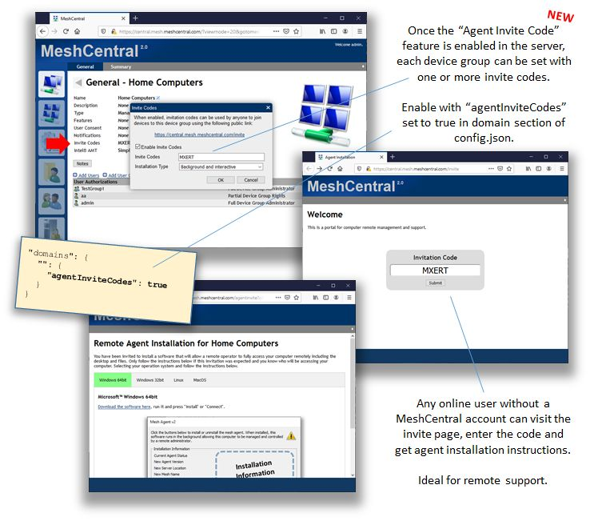
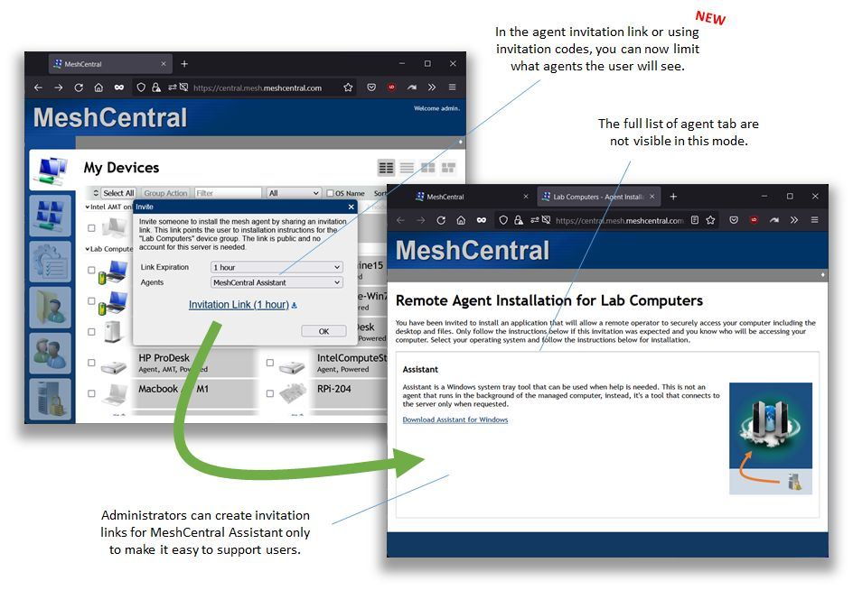
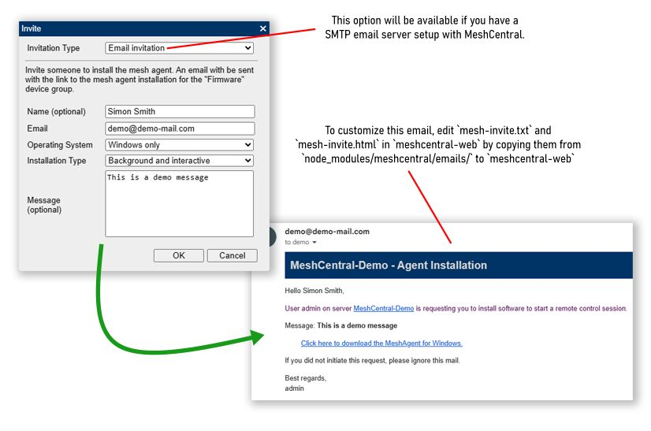
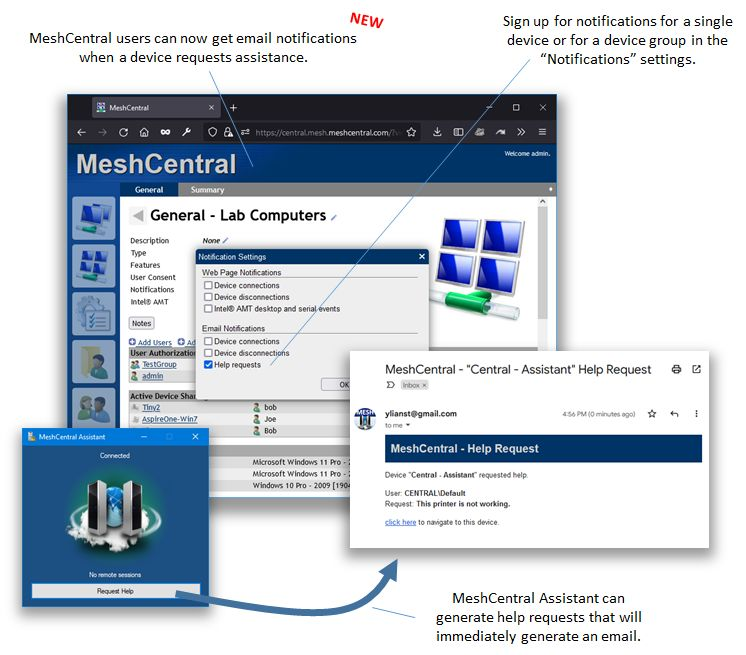

# MeshCentral 助手

## 初始设置

## 代理邀请码

```json
"domains": {
    "": {
        "agentInviteCodes": true
    }
}
```



## 代理邀请
点击设备组名称旁边的"邀请"按钮以访问它。
### 链接邀请
对于链接邀请网页自定义：

1. 在 `meshcentral-data` 旁边创建一个名为 `meshcentral-web` 的文件夹
2. 在其中创建一个 `views` 文件夹，并将文件 `node_modules/meshcentral/views/invite.handlebars` 复制到其中。
3. 该副本将代替默认文件提供服务，因此您可以根据需要进行自定义。



### 邮件邀请
如果您使用 MeshCentral 设置了 SMTP 邮件服务器，将显示此选项。

对于邀请邮件自定义：

1. 在 `meshcentral-data` 旁边创建一个名为 `meshcentral-web` 的文件夹
2. 在其中创建一个 `emails` 文件夹，并将文件 `node_modules/meshcentral/emails/mesh-invite.txt` 和 `node_modules/meshcentral/emails/mesh-invite.html` 复制到其中。
3. 这些副本将代替默认文件使用，因此您可以根据需要进行自定义。



## 邮件通知

当有人在助手代理中点击"请求帮助"按钮时，您还可以收到邮件通知。


