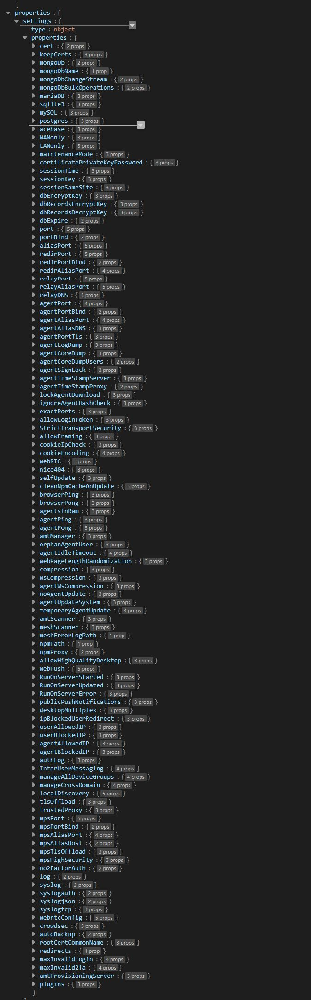
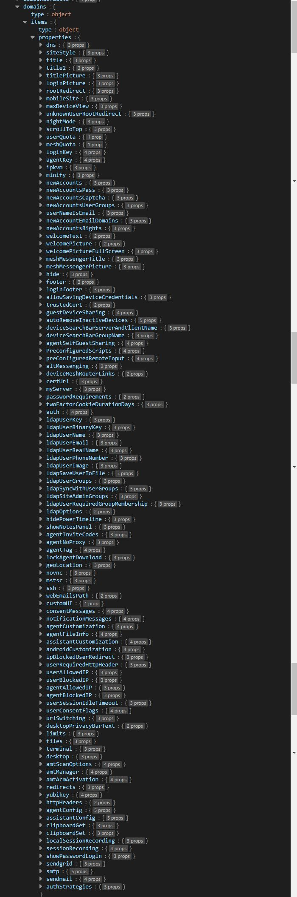

# 配置选项

MeshCentral 有许多可用的配置选项，在此文件中搜索选项：<https://github.com/Ylianst/MeshCentral/blob/master/meshcentral-config-schema.json>

您可以找到的一些选项包括：

* DNS
* HTTPS
* MPS（管理存在服务器）
* MongoDB
* MariaDB
* SQLite3
* MySQL
* PostgreSQL
* AceBase
* WAN（广域网）
* LAN（局域网）
* 维护模式
* 会话 Cookie
* 数据库加密
* Web 中继
* 代理连接
* TLS（传输层安全）
* WebRTC
* Web 推送通知
* 自动备份
* Crowdsec
* IP KVM（基于 IP 的键盘、视频、鼠标）
* Mesh 路由器
* Syslog
* WebDAV
* 证书和认证
* MeshCentral 服务器设置
* 设备管理
* 用户权限
* 远程桌面配置

等等！

