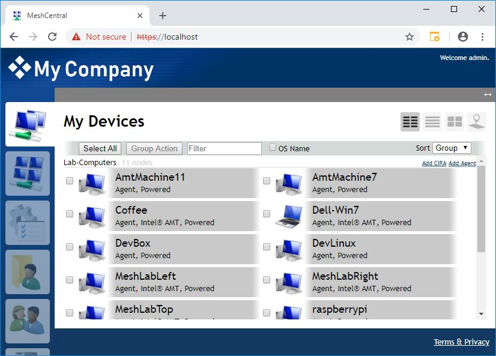
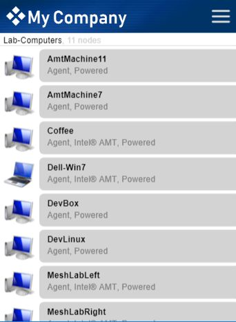
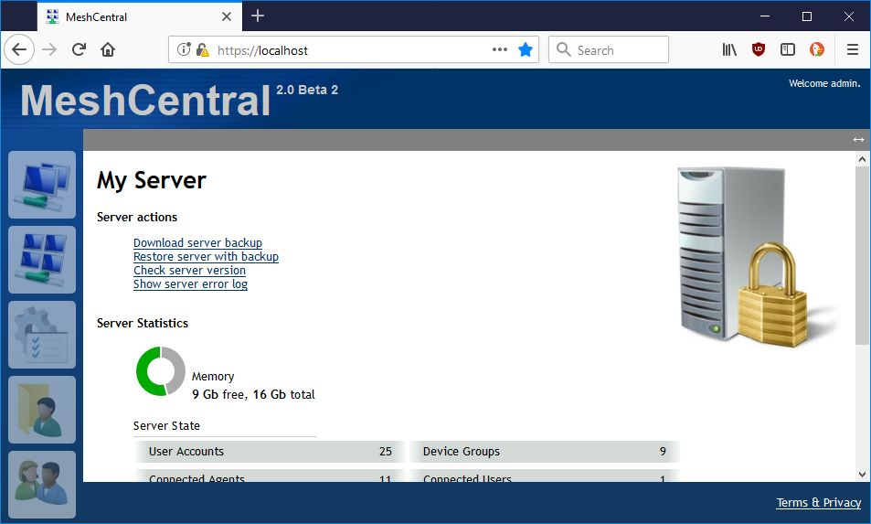
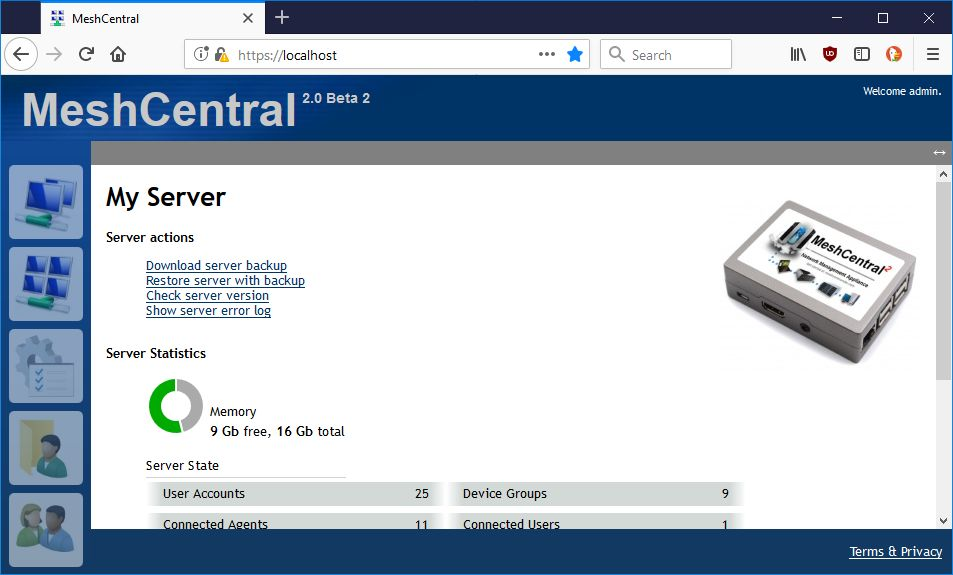
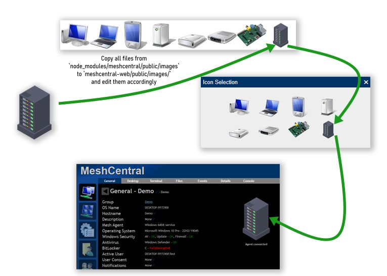
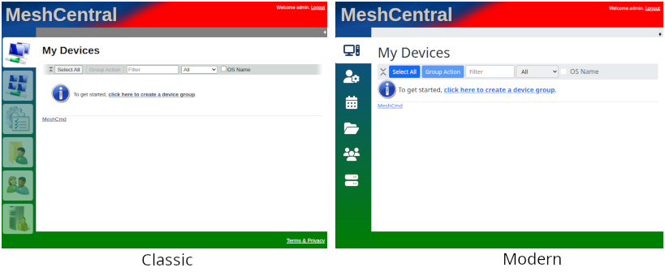
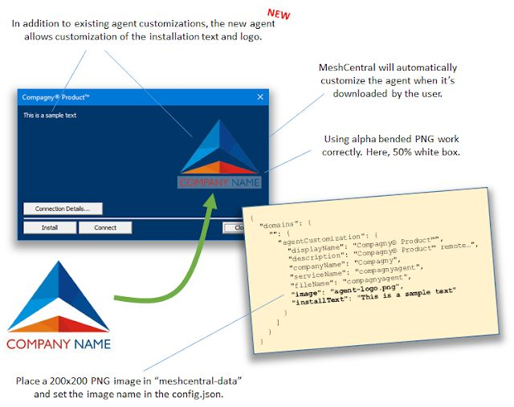
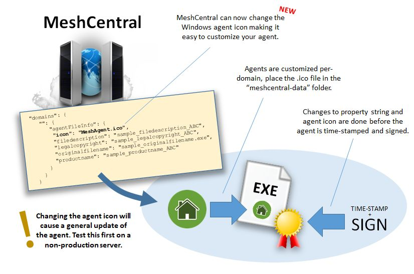

# 自定义

对 MeshCentral 安装进行白标，使其符合您公司的品牌，以及拥有您自己的使用条款，是许多人安装后首先要做的事情之一。

<div class="video-wrapper">
  <iframe width="320" height="180" src="https://www.youtube.com/embed/xUZ1w9RSKpQ" frameborder="0" allowfullscreen></iframe>
</div>

## Web 品牌

您可以将自己的徽标放在网页顶部。首先，从文件夹 "node_modules/meshcentral/public/images" 中获取文件 "logoback.png" 并将其复制到您的 "meshcentral-data" 文件夹。在此示例中，我们将文件 "logoback.png" 的名称更改为 "title-mycompany.png"。然后使用任何图像编辑器更改图像并放置您的徽标。


完成后，编辑 config.json 文件并设置以下一个或所有值：

```json
"domains": {
  "": {
    "Title": "",
    "Title2": "",
    "TitlePicture": "title-sample.png",
    "loginPicture": "logintitle-sample.png",
    "welcomeText": "This is sample text",
    "welcomePicture": "mainwelcome-04.jpg",
    "welcomePictureFullScreen": true,
    "siteStyle": "1",
    "nightMode": "1",
    "meshMessengerTitle": "Mesh Chat",
    "meshMessengerPicture": "chatimage.png",
    "footer": "This is a HTML string displayed at the bottom of the web page when a user is logged in.",
    "loginfooter": "This is a HTML string displayed at the bottom of the web page when a user is not logged in."
  },
```

这将将标题和副标题文本设置为空，并将背景图像设置为新的标题图片文件。您现在可以重新启动服务器并查看网页。桌面和移动站点都将更改。





标题图像必须是大小为 450 x 66 的 PNG 图像。

您还可以在"我的服务器"选项卡中自定义服务器图标。默认情况下，它是一个带挂锁的桌面图片。



例如，如果 MeshCentral 在 Raspberry Pi 上运行。您可能想在此位置放置不同的图片。只需将大小为 200 x 200 像素的 "server.jpg" 文件放入 "meshcentral-data" 文件夹中。当 MeshCentral 页面加载时，您将看到新图像。



这对于在网站中个性化服务器的外观非常有用。

### 自定义 Web 图标
MeshCentral 允许您更改 Web 用户界面中显示的不同设备的图标。要正确地执行此操作，您应该在主目录中创建一个名为 `meshcentral-web` 的新文件夹，在其中您可以找到其他文件夹，如 `meshcentral-data`、`meshcentral-backup`、`meshcentral-files` 和 `node-modules`。在 `meshcentral-web` 中，创建另一个名为 `public` 的文件夹，并将整个 `node_modules/meshcentral/public/images` 文件夹复制到这个新的 `meshcentral-web/public` 文件夹中，然后编辑 `meshcentral-web/public/images/` 中的文件。建议执行此步骤，因为如果 MeshCentral 更新，它可能会删除 `node_modules` 中的任何更改。但是，`meshcentral-web` 中的更改将保持安全，MeshCentral 将使用这些文件而不是 `node_modules` 中的原始文件。

要更新设备图标，您需要编辑以下文件：`meshcentral-web/public/images/webp/iconsXX.webp`（`icons16.webp`、`icons32.webp`、`icons50.webp`、`icons100.webp`）和 `meshcentral-web/public/images/iconsXX.png`（`icons16.png`、`icons32.png`、`icons50.png`、`icons64.png`、`icons100.png`）以及相应的 `meshcentral-web/public/images/icons256-X-1.png`。请确保保持这些文件的分辨率不变。 

通过执行这些步骤，您可以自定义 MeshCentral 中的任何图标。只需在 `meshcentral-web/public/images` 文件夹中找到并更改相应的图像文件即可。类似地，您还可以将其他文件夹从 `node_modules/meshcentral` 移动到 `meshcentral-web`，同时保持原始文件夹结构。这也允许您修改 MeshCentral 的其他部分，例如 Web 界面的 `.handlebars` 模板。只需将文件从 `node_modules/meshcentral/views` 复制到 `meshcentral-web/views`，然后在 `meshcentral-web` 中进行更改。这使您可以将 MeshCentral 的外观与您的公司品牌或您自己的风格相匹配。   
  

### 自定义 Web 样式
MeshCentral 为您提供了覆盖部分或全部 Web 界面的灵活性。修改样式的简单方法是执行以下操作：

1. 在 `meshcentral-web/public/styles` 下创建文件 `custom.css`。有关 `meshcentral-web` 的更多信息，请参见[上文](#customizing-web-style)。
2. 添加到此文件的任何内容都将覆盖默认样式表。 

示例文件：

```css
#masthead {
     background-color: red;
}

#page_leftbar {
     background: linear-gradient(to bottom, #104893 0%,green 100%)
}

#footer {
     background-color: green;
}
```

效果：



!!!note
您当然可以通过直接将样式表复制到 `meshcentral-web/public/styles` 来覆盖它们，但存在风险，即 MeshCentral 中对这些文件的未来更新将被屏蔽。`custom.css` 保证在每个页面上最后加载，并且默认情况下不包含任何内容，这意味着升级将正常工作。 


### 自定义代理邀请
代理可以通过公共链接或电子邮件邀请。[点击此处](assistant.md#agent-invitation)查看详细信息。 

## 代理品牌

您可以自定义代理以添加自己的徽标、更改标题栏、安装文本、服务名称，甚至颜色！

!!!note
	自定义必须首先在部署代理之前完成！一旦代理被部署，之后进行的任何自定义都不会同步！这是因为安装文件是动态自定义的，然后当您安装代理时，包含自定义的 exe 和 .msh 文件会被复制到所需的文件夹中，因此您需要重新安装代理才能使代理自定义生效。



```json
"domains": {
	"": {
		"agentCustomization": {
			"displayName": "MeshCentral Agent",
			"description": "Mesh Agent background service",
			"companyName": "Mesh Agent Company",
			"serviceName": "Mesh Agent Service",
			"installText": "Text string to show in the agent installation dialog box",
			"image": "mylogo.png",
			"fileName": "meshagent",
			"foregroundColor": "#FFA500",
			"backgroundColor": "#EE82EE"
		}
	}
}
```



## 使用条款

您可以通过在 "meshcentral-data" 文件夹中添加 "terms.txt" 文件来更改网站的使用条款。该文件可以包含 HTML 标记。设置后，服务器不需要重新启动，更新的 terms.txt 文件将在下次请求时使用。

例如，将此内容放入 "terms.txt"

```
<br />
This is a <b>test file</b>.
```

将在使用条款网页上显示此内容。
