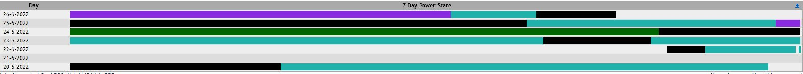
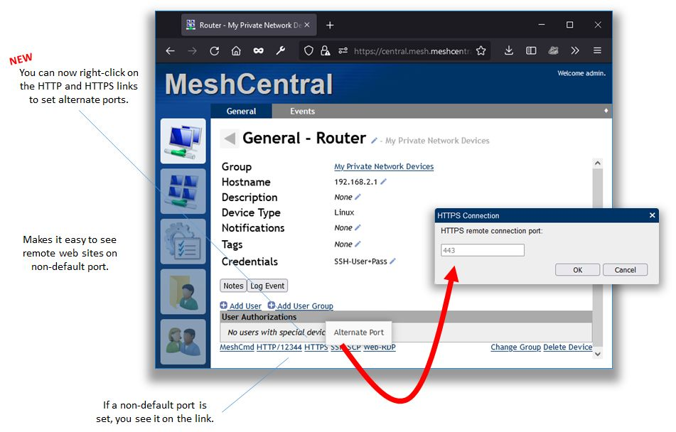
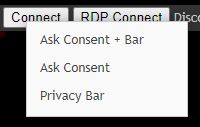
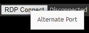
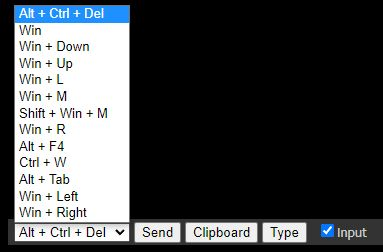
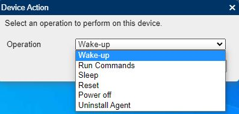
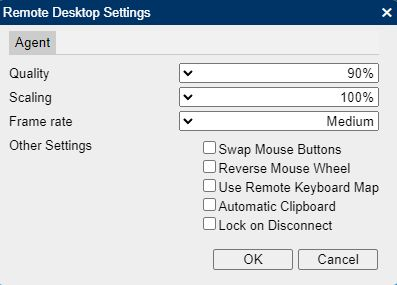
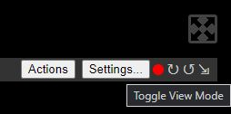
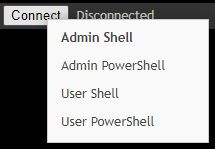
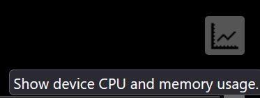

# 设备选项卡

## 搜索或筛选

您可以使用筛选框使用以下任何条件搜索代理列表（也可在筛选框的工具提示中查看）：

```
user:xxx or u:xxx
ip:xxx
group:xxx or g:xxx
tag:xxx or t:xxx
atag:xxx or a:xxx
os:xxx
amt:xxx
desc:xxx
wsc:ok
wsc:noav
wsc:noupdate
wsc:nofirewall
wsc:any
```

## 常规

用于查看有关代理的常规信息

* Group
* Description
* IP-KVM Port Number
* IP-KVM Port Type
* Intel AMT
* Intel AMT Tag
* Mesh Agent
* Operating System
* Windows Security
* Antivirus
* Active User
* User Consent
* Notifications
* Tags

### 字段

### 按钮

操作
备注
记录事件
消息
PDU 开/关/控制
聊天

### 7 天电源状态



图例

* **_黑色_**: 设备已开启（Intel AMT 和代理）
* **_紫色_**: 设备处于睡眠状态，例如休眠（仅限 Intel AMT 代理）
* **_青绿色_**: 设备通过 AMT/CIRA 连接，但电源状态未知（仅限 Intel AMT 代理）
* **_深绿色_**: 设备通过 AMT/CIRA 连接并处于软关闭电源状态（仅限 Intel AMT 代理）
* **_灰色_**: 设备已关闭/未连接到 MeshCentral（Intel AMT 和代理）

### 文本链接

如果链接不是默认端口，您可以通过右键单击在链接中设置备用端口。



* Interfaces
* Location
* MeshCmd
* RDP
* Web-VNC
* Web-RDP
* Web-SSH
* XTerm
* HTTP
* HTTPS
* SSH
* SCP
* MQTT Login

## 桌面

用于连接到机器的 KVM 接口。

### 连接按钮

右键单击连接按钮将为您提供其他选项：

* 请求同意 + 栏
* 请求同意
* 隐私栏



### RDP 连接按钮

右键单击 RDP 连接按钮允许您指定备用端口。



### Intel AMT 连接按钮

使用 Intel AMT 控制硬件视频卡的视频输出。

### 桌面会话期间

**左下角包括：**



* 发送特殊键

**右上角包括：**

操作



* 唤醒
* 运行命令
* 睡眠
* 重置
* 关机
* 卸载代理

设置



* 质量
* 缩放
* 帧率
* 交换鼠标按钮
* 反转鼠标滚轮
* 使用远程键盘映射
* 自动剪贴板
* 断开连接时锁定



* 会话录制指示器
* 屏幕旋转
* 切换视图模式
* 全屏

右下角包括：


* 与访客共享会话
* 在访客上切换键盘锁定
* 刷新桌面视图
* 上传剪贴板
* 下载剪贴板
* 录制会话到文件
* 截图
* 切换远程桌面背景
* 在远程桌面上打开 URL
* 锁定远程计算机
* 在远程计算机上显示通知
* 打开聊天窗口

## 终端

用于连接到代理上的基于命令行的接口

右键单击连接按钮允许您：

!!!note
    Linux 和 Windows 有不同的选项：

* 管理员 Shell (Windows)
* 管理员 Powershell (Windows)
* 用户 Shell (Windows)
* 用户 Powershell (Windows)
* SSH (Linux)



## 文件

用于与代理传输文件。

## 事件

与代理相关的 Mesh 事件。这是您的审计日志，用于查看从 MeshCentral 服务器对代理执行的操作。

## 详细信息

代理信息包括：

* 操作系统
* 代理信息
* 网络信息
* BIOS
* 主板
* 内存
* 存储
* Intel AMT

注意：您可以通过单击右上角的图标来显示 CPU 和内存使用信息



## Intel AMT

## 控制台

用于调试和与 mesh 代理通信。

它允许向设备发出 JS 命令，但也允许从 meshcore 运行额外的命令。输入 `help` 查看所有可用选项

- 2falock
- acceleratorsstats
- agentissues
- agentstats
- amtacm
- amtmanager
- amtpasswords
- amtstats
- args
- autobackup
- backupconfig
- bad2fa
- badlogins
- certexpire
- certhashes
- closeusersessions
- cores
- dbcounters
- dbstats
- dispatchtable
- dropallcira
- dupagents
- email
- emailnotifications
- firebase
- heapdump
- heapdump2
- help
- info
- le
- lecheck
- leevents
- maintenance
- migrationagents
- mps
- mpsstats
- msg
- nodeconfig
- print
- relays
- removeinactivedevices
- resetserver
- serverupdate
- setmaxtasks
- showpaths
- sms
- swarmstats
- tasklimiter
- trafficdelta
- trafficstats
- updatecheck
- usersessions
- versions
- watchdog
- webpush
- webstats
