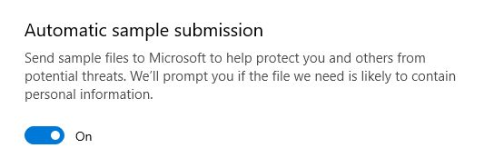
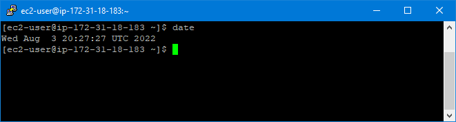
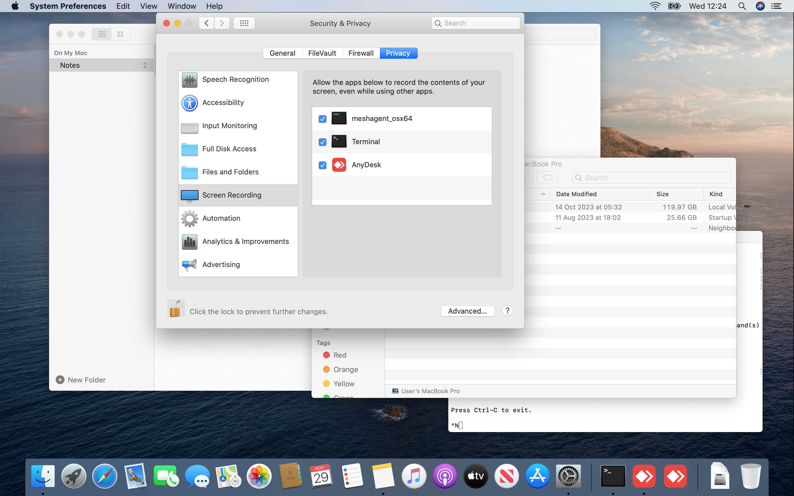
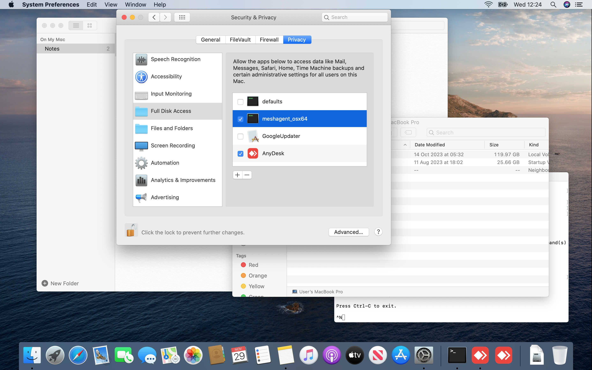
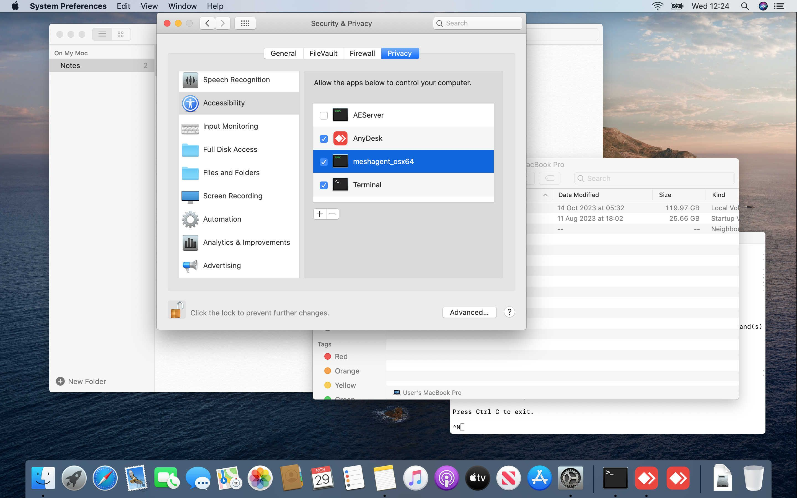

# 常见问题

## json 配置文件

config.json 文件中以下划线字符开头的任何项目都会被忽略。

被忽略

```json
"_title": "MyServer"
```

有效设置

```json
"title": "MyServer"
```

json 需要正确的格式，如果不确定，请将您的 json 配置复制/粘贴到基于网络的格式检查器中，以确保您做对了：<https://duckduckgo.com/?va=j&t=hc&q=json+lint&ia=answer>

## 救命！我被黑客攻击了，我的 MeshCentral 控制台中出现了奇怪的代理

不，您没有被攻击。

1. 您的代理安装程序被防病毒软件扫描了。

2. 它没有识别出 exe 文件。

3. 您启用了提交未知应用程序进行分析的选项。

    

4. 他们在其虚拟化测试集群上运行了它。

5. 您允许任何人连接到您的服务器（您应该研究一些技术来向互联网隐藏您的服务器）。

6. 以下是一些示例，展示了它的样子。

## 首次设置后无法登录服务器

您确定您输入的所有内容都是正确的，提供了双因素认证代码但仍然无法登录

[TOTP](https://en.wikipedia.org/wiki/Time-based_one-time_password) 是时间敏感的，请检查您的时间/NTP 并确保它是正确的（在服务器和 TOTP 应用设备上）！:)



## 品牌和定制

您可以根据自己的喜好对 MeshCentral 进行品牌和定制，而无需深入研究代码，只需在 config.json 文件中进行一些更改并上传图片即可改变系统的外观。在[这里](https://ylianst.github.io/MeshCentral/meshcentral/#branding-terms-of-use)阅读更多

!!!note
    您需要重新安装代理才能使代理定制生效。

## Mac 客户端

由于 MacOS 安全系统在安全与隐私 > 隐私下的限制，您必须在代理安装过程之外手动授予 Mac 权限

要查看屏幕（否则您只能看到菜单栏，其他为空白）



为了能够传输文件



为了能够控制键盘和鼠标



## 我正在使用 CloudFlare，但屏幕是黑色的，但鼠标可以移动？

如果您使用 CloudFlare 进行 DNS 托管，并且您的远程屏幕是黑色的，请不要惊慌！

不幸的是，MeshCentral 并不总是与 CloudFlare 的代理 DNS 模式兼容。

解决方法很简单，只需在 CloudFlare 控制面板中的 DNS A 记录内将"代理状态"设置为 OFF。

只需按照[这里](https://developers.cloudflare.com/fundamentals/setup/manage-domains/pause-cloudflare/#disable-proxy-on-dns-records)的步骤操作

完成后，为您托管 meshcentral 的 `port` 和 `agentPort` 端口打开防火墙，然后重新启动 MeshCentral 服务器

目前有一个关于此问题的置顶 GitHub 问题 [here](https://github.com/Ylianst/MeshCentral/issues/5302)

