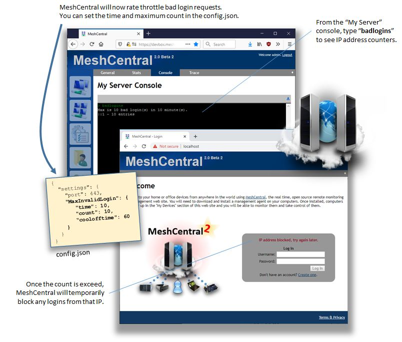

# 安全

## 限制登录尝试速率

您可以使用 MeshCentral 服务器控制台和命令 `badlogins` 查看当前设置。

在您的 `config.json` 中调整这些项目

```json
"settings": {
    "_maxInvalidLogin": {
    "time": 10,
    "count": 10,
    "coolofftime": 10
    },
}
```



## 为 AMT 禁用 TLS 1.0/1.1

```json
{
  "settings": {
    "mpshighsecurity": true
  }
}
```

## Duo 双因素认证设置

MeshCentral 支持 Duo 作为用户添加双因素认证的方式，Duo 为 10 个用户提供免费账户。首先，访问 [Duo.com](https://duo.com/) 创建一个免费账户。登录 Duo 后，在左侧选择"应用程序"和"保护应用程序"。搜索"Web SDK"并点击"保护"按钮。您将看到一个屏幕，其中包含以下信息：

 - 客户端 ID
 - 客户端密钥
 - API 主机名

将这三个值复制到安全的地方，不要与任何人分享这些值。然后，在您的 MeshCentral config.json 文件中，在域部分添加以下内容：

```json
{
  "domains": {
    "": {
      "duo2factor": {
        "integrationkey": "ClientId",
        "secretkey": "ClientSecret",
        "apihostname": "api-xxxxxxxxxxx.duosecurity.com"
      }
    }
  }
}
```

重新启动 MeshCentral，您的服务器现在应该支持 Duo。用户将在"我的账户"选项卡中看到启用它的选项。启用时，用户将被引导完成下载移动应用程序和进行双因素认证试运行的过程。已设置的用户将被添加到您的 Duo 账户中的"用户"/"用户"屏幕下。请注意，"admin"用户在 Duo 中无效，因此，如果您在 MeshCentral 中有名为"Admin"的用户，他们尝试设置 Duo 时会收到错误。
