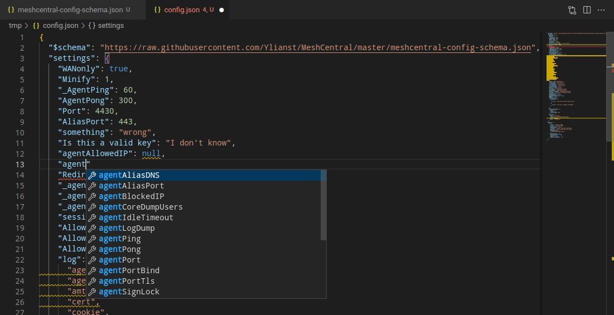

# 技巧与窍门

## SSH 中的颜色

SSH 终端确实支持颜色。问题将是 shell 的终端配置。尝试输入这个：

```bash
ls -al --color /tmp
```

## 使用 VS Code 进行高级配置编辑

问题中一个常见的问题是 config.json 不正确。什么使配置不正确？如何验证您的配置是正确的？

很简单！使用 Visual Studio Code 编辑您的 config.json 并在顶部添加模式。

如果您还没有下载 VS Code。
下载或复制 config.json 到您的计算机。
在 Code 中打开 config.json 并将模式作为顶行添加。此模式是 MeshCentral 仓库中的原始 JSON 文件。

```json
{
  "$schema": "https://raw.githubusercontent.com/Ylianst/MeshCentral/master/meshcentral-config-schema.json",
  "settings": {
    "your settings go here": "..."
  }
}
```

现在您拥有 config.json 的自动完成、自动格式化和验证功能！如果您开始输入，Code 将显示对您正在编辑的位置有效的值。带有红色波浪线的单词是错误。带有橙色波浪线的单词是警告。将鼠标悬停在两者上可查看错误消息和可能的修复。Code 甚至可以格式化您的配置。

虽然这是一个巨大的进步，但它并不完美。如果您注意到，屏幕截图中有一些无效的键。这是完全有效的 JSON，MeshCentral 将忽略它们（也许？）。如果您将某些配置粘贴到错误的部分，Code 不会告诉您它在错误的部分。自动完成将告诉您哪些键是有效的以及值的类型（即字符串、数字、布尔值）。

希望这将有助于验证您的配置在语法上是正确的，并防止不必要的格式化错误、拼写错误等。



## 下载文件夹

如果您想通过文件下载文件夹，只需选择文件夹/文件，然后使用 zip 并点击它来下载 zip 文件。

## 与 AD 登录共享设备组
如果您想与不同的 AD 用户共享设备组。

在 config.json 中将 "ldapuserkey" 设置为 "sAMAccountName"。
