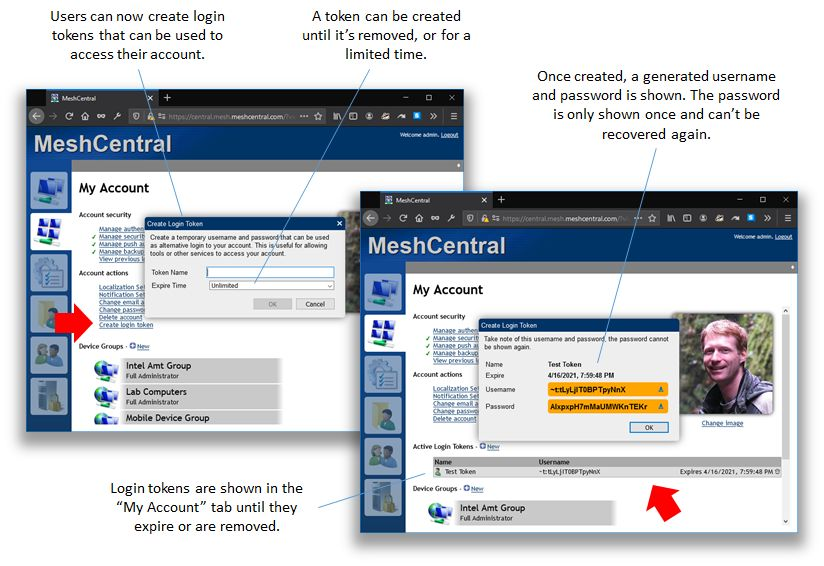
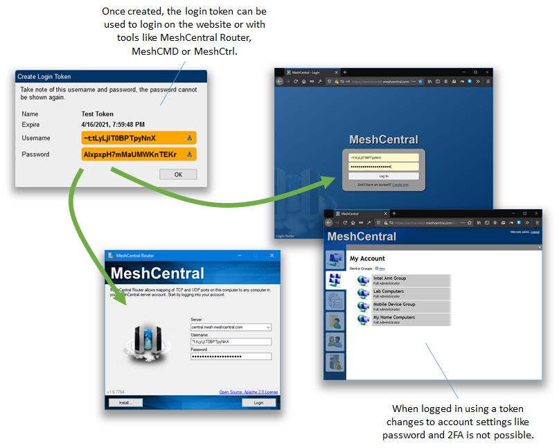

# 14.1 令牌

## 用户令牌





## 软件集成令牌

!!!warning
    您的 meshcentral 服务器只能拥有一个 loginTokenKey！<br>
    因此，如果您重新生成 loginTokenKey，旧的令牌将被撤销/删除！

您可以使用以下命令创建/查看登录令牌密钥：

```bash
node node_modules/meshcentral --loginTokenKey
```

然后，您可以使用以下命令重置/撤销/续期登录令牌密钥以创建新密钥：

```bash
node node_modules/meshcentral --loginTokenKey --loginTokenGen
```
